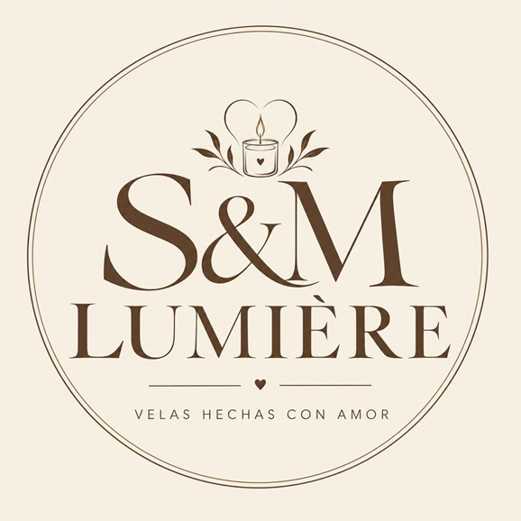
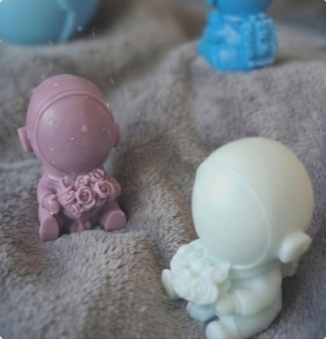

# Velas-smlumiere
Velas hechas con amor
<!DOCTYPE html>
<html lang="es">
<head>
    <meta charset="UTF-8">
    <meta name="viewport" content="width=device-width, initial-scale=1.0">
    <title>Vela Astronauta con Ramo - S&M Lumière</title>
    
</head>
<body>

    <!-- Encabezado con Marca/Logo -->
    

        
        
S&M Lumière

    

    <!-- Fotografía del producto -->
    

        

            
        

        
Vela Astronauta Artesanal

    

    <!-- Título -->
    <h1 class="product-title">Vela Astronauta con Ramo</h1>

    <!-- Características -->
    <h3 class="section-subtitle">Detalles de la pieza</h3>
    <ul class="details-list">
        <li>Aroma Andalucía</li>
        <li>Duración 4 a 6 horas</li>
        <li>Cera 100% Soya Artesanal</li>
        <li>Diseño Modelado a mano</li>
    </ul>

    <!-- Consejos / Cuidados -->
    <h3 class="section-subtitle">Cuidados</h3>
    

        Disfruta de tu pieza recortando la mecha a unos 5 mm antes de cada encendido para asegurar una combustión limpia y prolongada. Evita corrientes de aire.
    

    <!-- Botón de WhatsApp Corregido -->
    <a href="https://wa.me/573189392063?text=¡Hola!%20Tengo%20una%20duda%20sobre%20los%20cuidados%20de%20mi%20Vela%20Astronauta." 
       class="btn-whatsapp" target="_blank">
        <svg width="18" height="18" fill="white" viewBox="0 0 24 24">
            <path d="M12.031 2c-5.514 0-9.999 4.486-9.999 10 0 1.763.46 3.483 1.332 5.004L2 22l5.148-1.348C8.625 21.498 10.312 22 12.031 22c5.515 0 10-4.486 10-10s-4.485-10-10-10zm5.952 14.155c-.252.712-1.463 1.359-2.01 1.417-.502.054-1.144.083-3.327-.818-2.793-1.154-4.577-4.008-4.717-4.195-.14-.187-1.139-1.517-1.139-2.893 0-1.376.712-2.052.966-2.333.253-.28.557-.35.743-.35.187 0 .373.003.535.01.173.007.406-.066.634.48.239.574.815 1.988.887 2.133.072.146.12.316.024.505-.096.188-.144.305-.287.472-.144.167-.302.373-.431.502-.144.143-.294.3-.126.587.168.287.747 1.233 1.603 1.996 1.101.98 2.029 1.285 2.316 1.428.287.143.455.12.623-.072.168-.192.718-.838.911-1.125.192-.287.383-.239.646-.144.264.096 1.674.789 1.961.933.287.144.478.216.55.336.072.12.072.695-.18 1.407z"/>
        </svg>
        Consultar por WhatsApp
    </a>

    <!-- Sistema de Calificación -->
    

        
¿Qué te parece este diseño?

        

            <input type="radio" id="star5" name="rating" value="5" onclick="showThanks()"><label for="star5">★</label>
            <input type="radio" id="star4" name="rating" value="4" onclick="showThanks()"><label for="star4">★</label>
            <input type="radio" id="star3" name="rating" value="3" onclick="showThanks()"><label for="star3">★</label>
            <input type="radio" id="star2" name="rating" value="2" onclick="showThanks()"><label for="star2">★</label>
            <input type="radio" id="star1" name="rating" value="1" onclick="showThanks()"><label for="star1">★</label>
        

        
¡Gracias por tu valoración! ✨

    

</body>
</html>
